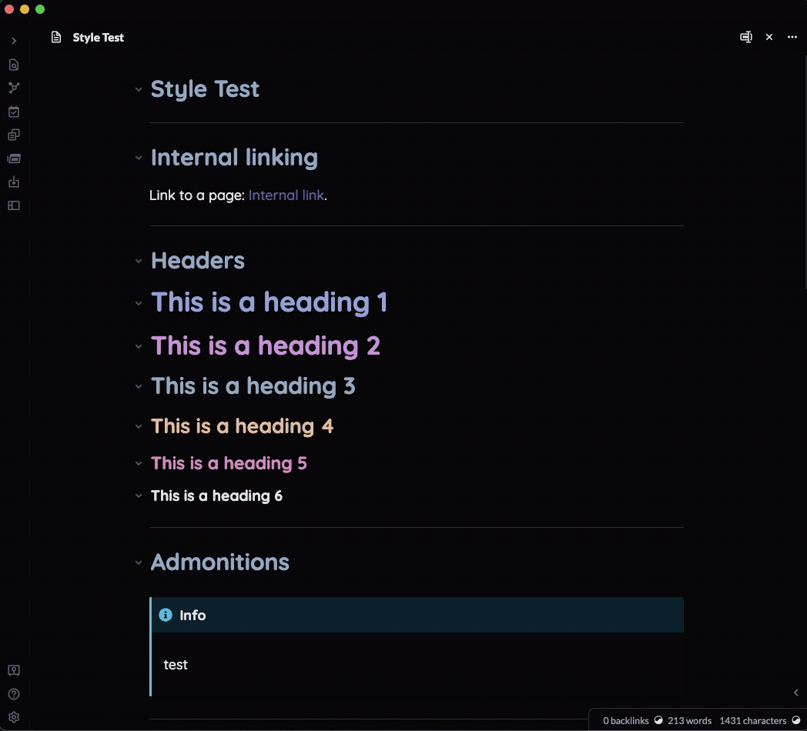

## Obsidian Print Preview

This plugin helps theme designers debug export to pdf issues by allowing them to inspect the print results

### Features

- Regex functionality added to the default Obsidian search
- Regex also works with Search & Replace
- Capture groups are now supported for replacement
  - Use dollar sign references to refer to capture groups: $1 $2 etc
- Support for case-insensitive mode using /foo/i

### Instructions

- Export to PDF as you normally would
- After export, the rendered print window will show up overlaid on top of your workspace
- You can now use the Dev Tools inspector to check the styling of the printed content
- To dismiss the print window, left click anywhere in the workspace

### FAQ

- My PDF doesn't look like the print preview
  - Make sure to set "Emulate CSS media type" to "print" in chrome (see the demo video for details)
- I dismissed the print preview and now my Obisidian screen is blank
  - Make sure to turn "Emulate CSS media type" back to "no emulation" as the default Obsidian theme hides all UI elements in print media mode.

### Not currently supported

- Viewing the preview prior to PDF creation
  - The preview will only be visible after export has completed.
- Downscale support
  - Currently the preview will show at 100% despite the % specified in the downscale setting

### Manually installing the plugin

- Copy over `main.js`, `styles.css`, `manifest.json` to your vault `VaultFolder/.obsidian/plugins/obsidian-print-preview/`.
